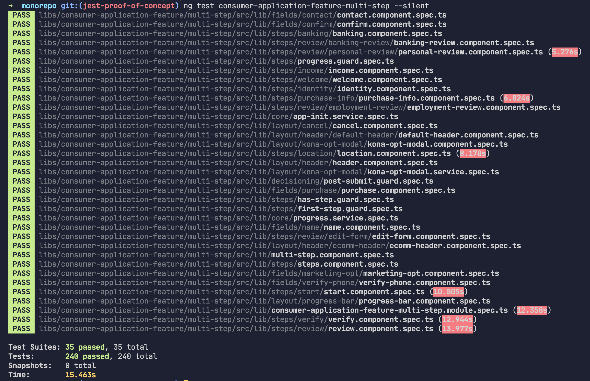
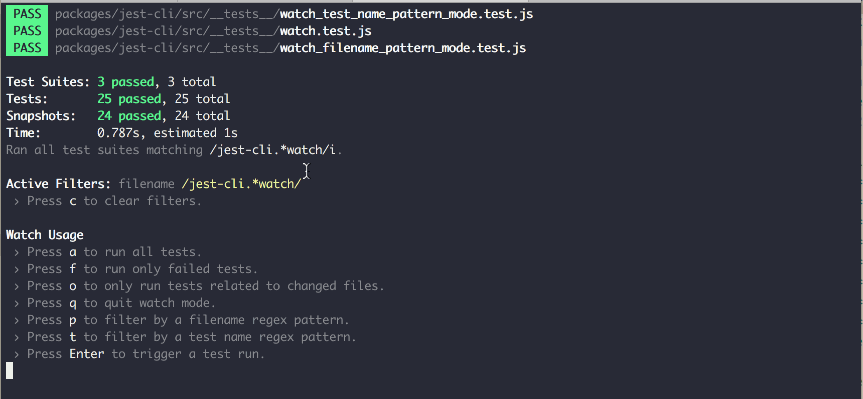

# Migrating to Jest

## Table of Contents

- [Migrating to Jest](#migrating-to-jest)
  - [Table of Contents](#table-of-contents)
  - [Why migrate?](#why-migrate)
    - [Speed](#speed)
    - [Support](#support)
      - [Community support](#community-support)
      - [Support from Nrwl](#support-from-nrwl)
    - [Docs](#docs)
    - [Simplicity](#simplicity)
    - [Features](#features)
      - [Interactive CLI](#interactive-cli)
      - [Other features](#other-features)
  - [What would migration require?](#what-would-migration-require)
    - [Example: Migrating a project to Jest](#example-migrating-a-project-to-jest)
    - [Global changes](#global-changes)
    - [Updating/revisiting our custom matchers](#updatingrevisiting-our-custom-matchers)
  - [Pros and cons of migrating](#pros-and-cons-of-migrating)
    - [Pros](#pros)
    - [Cons](#cons)
  - [Suggested migration approach](#suggested-migration-approach)

## Why migrate?

### Speed

It's well established that Jest is faster than Karma:

- [Nx 6.3: Faster Testing with Jest](https://blog.nrwl.io/nrwl-nx-6-3-faster-testing-with-jest-20a8ddb5064)
- [Make your Angular tests 1000% faster by switching from Karma to Jest](https://dev.to/dylanwatsonsoftware/make-your-angular-tests-1000-faster-by-switching-from-karma-to-jest-1n33)
- [Testing Angular Faster with Jest](https://www.xfive.co/blog/testing-angular-faster-jest/)
- [How to use Jest in Angular aka make unit testing great (again)](https://itnext.io/how-to-use-jest-in-angular-aka-make-unit-testing-great-again-e4be2d2e92d1)

I tried an experiment on a part of our own codebase: `consumer-application-feature/multi-step`. This library has **35** test suites and contains a total of **240** tests.

Here are the results (seconds):

| Attempt | Karma | Karma Headless | Jest  |
| ------- | ----- | -------------- | ----- |
| 1       | 37.06 | 33.20          | 14.34 |
| 2       | 32.66 | 32.78          | 13.92 |
| 3       | 32.71 | 32.63          | 14.02 |

During this experiment I noticed that Jest's output highlights slow test suites:



This output suggests that _we_ may be the bottleneck on Jest's speed (perhaps from using `async` tests), and that it could run even faster if we optimize some of these tests.

### Support

Jest has incredible support from the JavaScript community as a whole, but also from Nrwl in particular.

#### Community support

Jest is maintained and used by Facebook for their production apps (https://github.com/facebook/jest), so it's likely that support for Jest will remain strong. NPM trends and Github stars show Jest far ahead of Karma, but most of that is probably because Jest is often used with React:

<figure>
  
  <figcaption>
    <a href="https://www.npmtrends.com/jest-vs-karma">NPM Trends: Jest vs. Karma</a>
  </figcaption>
</figure>

#### Support from Nrwl

Nrwl has moved fully to Jest for all new workspaces. In fact, they [don't even include karma as a visible option](https://github.com/nrwl/nx/issues/1572) in the Nx CLI anymore. They have a [section on their site](https://nx.dev/web/guides/modernize-jest) about using Jest (but not Karma) where they've summarized their reasoning for moving to Jest:

> - Jest was built with monorepos in mind and is able to isolate the important parts of a monorepo to test.
> - Jest has a great built-in reporter for printing out results of tests.
> - Jest has an immersive watch mode which provides near instant feedback when developing tests.
> - Jest provides the ability to use Snapshot Testing to validate features.

### Docs

[Jasmine's documentation](https://jasmine.github.io/index.html) is just **terrible**. It's nearly impossible to find what you're looking for and when you search with Google half the time you end up on an outdated docs page.

[Jest's documentation](https://jestjs.io/) is complete with explanations and examples covering the entire API.

### Simplicity

Jest uses [jsdom](https://github.com/jsdom/jsdom), allowing it to run entirely within your terminal.

Karma opens/refreshes a new Chrome browser window every time it runs, which is distracting (for me, at least). It _does_ report results within the terminal, but the output is really difficult to read.

### Features

#### Interactive CLI

Jest includes an interactive CLI for watch mode that makes it really easy to integrate into your dev workflow. Watch mode automatically integrates with Git, comparing your changes with the last commit to decide which tests to run. When you run watch mode you're given the following options in your terminal.

```
Watch Usage
 › Press a to run all tests.
 › Press f to run only failed tests.
 › Press p to filter by a filename regex pattern.
 › Press t to filter by a test name regex pattern.
 › Press q to quit watch mode.
 › Press Enter to trigger a test run.
```

Narrowing down on a single test suite is really easy:



With Karma if you want to narrow down on tests you need to either:

- Use `--include **/*my-component.spec.ts` when you start the test runner
- Use `fdescribe` to isolate a single describe block

#### Other features

- Snapshot testing (I doubt we'll use this very much, but it's there)
- Code coverage tests

## What would migration require?

Luckily, **we don't have to do it all at once**. I created a branch and migrated two of our libraries to Jest, submitted a test PR, and unit tests passed even though most of them were using Karma and some were using Jest. This means we can migrate gradually, project by project.

### Example: Migrating a project to Jest

After installing the necessary dependencies, these are the steps I took to migrate a project to Jest:

1. Remove the `test` target for the project in `angular.json`
2. Delete the following files within the project:
   - `karma.conf.js`
   - `tsconfig.spec.json`
   - `test.ts`
3. Run the following:
   ```
   nx generate @nrwl/jest:jest-project --project components-library-tag
   ```
4. Add the following to `module.exports` in `tag/jest.config.js`:

   ```javascript
   // jest.config.js

   module.exports = {
     //...
     setupFilesAfterEnv: ['../../../test-setup.ts'],
     globals: {
       'ts-jest': {
         diagnostics: false
       }
     }
   }
   ```

   We're adding the `setupFilesAfterEnv` property and pointing it to our global setup file. We're turning off `ts-jest` diagnostics because Jest throws errors when it encounters our custom Jasmine matchers in our `test-helpers` library. If we convert these to custom Jest matchers we can eventually turn diagnostics back on.

   We could probably technically move `snapshotSerializers` to the global `jest.config.js`, but by default Nx includes them in the local Jest config files because to support multi-platform monorepos.

   The file should look like something like this when you're done:

   ```javascript
   // jest.config.js

   module.exports = {
     name: 'components-library-tag',
     preset: '../../../jest.config.js',
     coverageDirectory: '../../../coverage/libs/components-library/tag',
     snapshotSerializers: [
       'jest-preset-angular/build/AngularNoNgAttributesSnapshotSerializer.js',
       'jest-preset-angular/build/AngularSnapshotSerializer.js',
       'jest-preset-angular/build/HTMLCommentSerializer.js'
     ],
     setupFilesAfterEnv: ['../../../test-setup.ts'],
     globals: {
       'ts-jest': {
         diagnostics: false
       }
     }
   }
   ```

5. Run `ng test components-library-tag`

   If you don't have any failed tests, you're done! 🎉

   So far these are the causes of failed tests I've seen (I'm sure there will be many more):

   - References to Jasmine methods and types. These all have Jest equivalents. Here are some of the changes I've made so far:
     |Jasmine|Jest|
     |---|---|
     |`jasmine.createSpy()`|`jest.fn()`|
     |`spyOnProperty(component, 'values', 'get').and.returnValue({})` | `jest.spyOn(component, 'values', 'get').mockReturnValue({})`|
     |`jasmine.Spy`|`jest.SpyInstance`|
     |`service = jasmine.createSpyObj('service', ['getData'])`|`service = { getData: jest.fn() }`|

   - Storing values as properties on the test function object:

     ```typescript
     // For some reason this doesn't work in Jest.
     // `this` is undefined
     it(`works`, function() {
       this.value = 5
     })

     // This is how I've been fixing it:
     it(`works`, function() {
       const value = 5
     })
     ```

   - Using [Spectator](https://github.com/ngneat/spectator) mocks, which rely on Jasmine spys internally. Luckily Spectator provides [Jest support](https://github.com/ngneat/spectator#jest-support) for its mocks, and all it requires is a change to imports:

     ```typescript
     // Replace this:
     import { createComponentFactory } from '@ngneat/spectator'
     // With this:
     import { createComponentFactory } from '@ngneat/spectator/jest'
     ```

### Global changes

1. Install jest dependencies (all are devDependencies):
   - `@nrwl/jest` - Adds jest schematics
   - `@testing-library/jest-dom` - Extends `expect` to add dom matchers
   - `@types/jest`
   - `jest`
   - `jest-preset-angular` - Base jest configuration for Angular
   - `jest-zone-patch` - Allows us to use zones in tests
   - `ts-jest` - Maintains TypeScript sourcemaps in jest tests
2. Add setup files to root of monorepo
   - `jest.config.js` - Inherits from `jest-preset-angular`
   - `test-setup.ts` - Imports `jest-zone-patch` and other files necessary for setting up the environment
   - `jestGlobalMocks.ts` - Mocks some parts of the DOM
3. Eventually we could remove the following after a full migration:
   - `jasmine-core`
   - `jasmine-spec-reporter`
   - `karma`
   - `karma-chrome-launcher`
   - `karma-coverage-istanbul-reporter`
   - `karma-jasmine`
   - `karma-jasmine-dom-matchers`
   - `karma-jasmine-html-reporter`
   - `@types/jasmine`
   - `@types/jasmine-dom-matchers`
   - From monorepo root:
     - `karma.conf.js`
   - From each project:
     - `karma.conf.js`
     - `test.ts`

### Updating/revisiting our custom matchers

We have 5 custom Jasmine matchers in our `test-helpers` library that we should port to Jest:

| Matcher                     | Uses |
| --------------------------- | ---: |
| `expectComponent`           |    0 |
| `expectElementFromFixture`  |   40 |
| `expectElementsFromFixture` |    5 |
| `expectElement`             |    0 |
| `expectElements`            |    0 |

I've learned we can actually still use them as is if we disable `ts-jest` diagnostics (I got this working with `consumer-application-feature/multi-step` even in CI), but that shouldn't be our long-term solution, especially if we're eventually going to drop Jasmine altogether.

Modifying them to extend Jest matchers instead of Jasmine matchers should take an hour or less. The file's only 47 lines long.

## Pros and cons of migrating

### Pros

- Jest is roughly 2.25x faster than Karma
- Jest has better support than Karma, from the JS community in general and from Nrwl in particular
- Jest's documentation is vastly superior to Karma and Jasmine's
- Jest doesn't require Chrome to run, making it less distracting and awkward
- Jest has an interactive watch mode that makes it really easy to narrow down on test suites
- We can migrate gradually, project by project
- Overall we'll end up with less devDependencies and less test configuration files

### Cons

- **It will take time that could be spent on other things.** It took me about 1.5 hours to migrate `consumer-application-feature/multi-step`, a library that has 240 tests in it. It's worth noting that I'm now more familiar with Jest APIs so future migrations would probably be faster.
- There will be a period of time where we have a `karma.conf.js` and a `jest.config.js` in the root of the monorepo. This could lead to confusion.

## Suggested migration approach

In order to get it done as quickly is possible and minimize the time that we're using both Karma and Jest my suggestion is that I (Wilson) spend time migrating all the projects that I know aren't being actively worked on.

For projects that are being actively worked on, we could have whoever is working on it migrate to Jest within a PR as part of their sprint, or we could hold off and wait until work has ceased on it, and migrate that project to Jest during a slow time.
